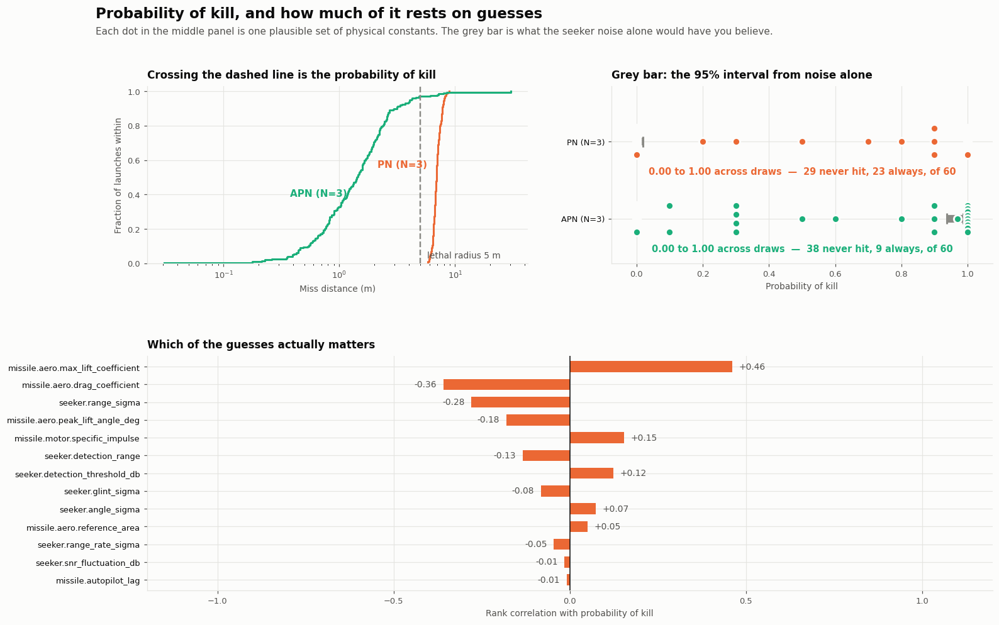

# Missile Intercept Tracker

[](https://github.com/AlexF0643/missile-intercept-tracker/actions/workflows/ci.yml)
[](https://www.python.org/downloads/)
[](LICENSE)

A 3-DOF missile intercept simulation. A noisy radar seeker looks at a
manoeuvring target a hundred times a second, a Kalman filter turns those
measurements into a track, and a proportional navigation law turns the track
into steering commands. You can watch the whole thing in 3D.

I'm a physics undergrad and I built this to understand proportional navigation
properly, rather than just reading the equation and nodding at it.


That's a target flying straight and then pulling 7 g at t = 8 s. The missile
still gets it, 3.7 m off, guided by a 2 mrad seeker and an EKF. The end plays at
quarter speed because at Mach 2 the last hundred metres take under a tenth of a
second and you can't see anything otherwise.

That's one seed though. Over six seeds this engagement only hits three times,
median miss 4.9 m against a 5 m lethal radius. It used to be a reliable hit and
became a coin toss when I added [induced drag](#turning-costs-energy).

Worth watching the LOS rate in the corner. Proportional navigation works by
keeping it steady while the range drops, and it blows up right at the end
because `Ω = (r × v) / (r · r)` has range squared on the bottom. That's why
terminal guidance saturates no matter how much airframe you give it.

## Try it

```bash
git clone https://github.com/AlexF0643/missile-intercept-tracker.git
cd missile-intercept-tracker
python3 -m venv .venv
source .venv/bin/activate
pip install -e ".[viz]"
interceptor serve               # browser window, everything in one place
```

On Windows, in PowerShell:

```powershell
git clone https://github.com/AlexF0643/missile-intercept-tracker.git
cd missile-intercept-tracker
py -m venv .venv
.venv\Scripts\Activate.ps1
pip install -e ".[viz]"
interceptor serve

```
If `py` isn't recognised and you use Anaconda, run these from the Anaconda Prompt
rather than PowerShell; anaconda keeps its Python off the system PATH.
```

Or from the command line, once installed:

```bash
interceptor list                            # scenarios that ship with it
interceptor run crossing --seed 3           # fly one
interceptor sweep crossing --seeds 20       # fly it 20 times
interceptor monte-carlo crossing            # ...and vary the constants too
interceptor record crossing -o flight.gif   # animation
interceptor view crossing                   # live 3D window, needs pip install -e ".[live]"
```
## What I found

Four things, roughly in the order I found them. Two of them are mistakes I made
and then caught, which I've left in because they're the most useful part.

### A filter is the difference between hitting and missing by a kilometre


Proportional navigation on perfect data intercepts within 34 cm. Give it a real
seeker and it misses by **1644 m**. Nothing wrong with the guidance law; the
problem is that I was getting relative velocity by finding the difference between two noisy
positions 10 ms apart, which multiplies a 2 mrad angle error by about a hundred.

Put an estimator in that gap and **1644 m becomes 1.05 m**. Same seeker, same
law, just something sensible in between.

The more interesting bit is the comparison between filters. Against a straight
target the heavily smoothed alpha-beta filter is the best thing here, 0.58 m,
because averaging beats noise and there's no signal being averaged away. Against
a 7 g break turn the same filter is the worst by a factor of three, 16.03 m,
because the smoothing that killed the noise also kills the manoeuvre. Its gains
were picked in advance and it can't change its mind.

The EKF is never the best in any panel and never bad in any of them, because it
works out how much to trust its own prediction every frame from its covariance.
That's the whole trade: a fixed gain has to be chosen for behaviour you don't
get to know about beforehand.

It also coasts through a 0.5 s blackout, since it keeps predicting when there's
nothing to correct with.

### The filter was lying about its uncertainty and I nearly missed it

Miss distance tells you whether the estimate was accurate. It says nothing about
whether the covariance the filter reports is honest, and those can come apart.
A filter that understates its uncertainty runs too small a gain and starts
ignoring measurements that disagree with it; fine on a quiet target, late on
the manoeuvre that matters.

The check for this is NEES: measure the error in units of the filter's own
claimed uncertainty, and it should average to the number of states, which here
is 6. Over 24 seeds mine scores **6.16 against an expected 6.00**, inside the 95%
interval, and stays there against a 6 g weave that its constant-acceleration
model doesn't describe.

First time I ran it, it scored **1804**.

The seeker holds each measurement back a frame and stamps it with when it was
taken. I was correcting the filter's current state with that stale measurement
while telling it where the missile was *now*. That folds one frame of relative
motion into every estimate as a fixed offset; 6.5 m at 650 m/s of closing,
against a filter claiming about 2 m of uncertainty.

Fixing it moved the miss distance by a few centimetres. That's exactly why I'd
never have found it any other way.

### Turning costs energy

Everything above changed when I made the aerodynamics admit that lift costs drag.

A body at incidence makes its normal force perpendicular to its own axis, not to
the flight path, so some of that force points backwards. `Cd = Cd0 + k·Cn²`,
with `k = 1/Cn_alpha`, and the lift-curve slope is just peak lift over the angle
it needs; the airframe had already declared everything I needed. At full lift
that's about four times the zero-lift drag. Before this the missile was turning
for free.

This overturned one of my headline results. Pure pursuit used to miss a straight
crossing target by 40.8 m. Now it hits by 1 cm. That's not pursuit being any
good: slowed by its own turning it stops overshooting, settles into a stern
chase, and runs a straight-flying target down eventually. Look at the cost, and
at what happens the moment the target does anything:

```
crossing geometry            miss       at   closing   arrival
  straight, pursuit         0.01 m   18.78s     72       322 m/s
  straight, pronav          0.34 m   13.51s    284       449 m/s
  weaving 6 g, pursuit     89.06 m   18.86s     75       273 m/s
  weaving 6 g, pronav       6.01 m   13.41s    282       430 m/s
```

So the old claim was partly an artefact of a missile fast enough to overshoot.
Pursuit only works against a target that flies perfectly straight and gives it
nineteen seconds, and it arrives with a quarter of the closing speed. A round
with no closing speed left can't answer a target that changes its mind, which is
what the weave row shows.

It also broke my Phase 5 result. With induced drag, PN plus a well-tuned EKF now
**misses** a manoeuvring target: 6.94 m on the weave and 4.87 m on the break
turn, against a 5 m lethal radius. The missile spends its energy turning and
arrives too slow to fix anything. That's not a bug, it's the model getting more
honest, and closing that gap is the next section.


Same missile, same weaving target, only the law differs. Pursuit steers at where
the target is, swings wide into a tail chase and misses by 89.1 m. PN steers to
stop the bearing drifting, cuts inside that arc, and misses by 6.0 m; five and
a half seconds sooner and with four times the closing speed.

### Augmented PN, and the thing I got wrong about it

PN drives the line-of-sight rate to zero. That's right against a target flying
straight and always one step behind one that's accelerating, since it only
reacts to bearing drift the manoeuvre has already caused. Augmented PN adds a
term for the acceleration itself:

```
a = N·V_c·(Ω × r̂)  +  (N/2)·a_t⊥
```

`N/2` isn't a tuning knob; it's the optimal-control answer for a target holding
*constant* acceleration, from the same criterion that gives `N = 3` against one
holding none.

```
crossing geometry, seeker + EKF, 6 seeds     PN (N=3)          APN (N=3)
  straight and level                     1.05 m   6/6      1.98 m   6/6
  break turn, 7 g at t=8 s               4.87 m   3/6      1.62 m   6/6
  weave, 6 g / 4 s                       6.94 m   0/6      1.21 m   6/6
  jink, 7 g every 1.5 s                 14.51 m   0/6     23.36 m   0/6
  barrel roll, 5 g / 4 s                30.68 m   0/6    469.36 m   0/6
```


Both cases induced drag broke come back completely. The break turn goes from a
coin toss to six from six, and the weave from never hitting to never missing.

Then the bottom two rows. A barrel roll makes APN **twelve times worse** than
the law it augments, and it does it on a perfect track, so the filter isn't the
explanation.

I wrote this up as APN's assumption failing. A barrel roll holds acceleration
*magnitude* constant while rotating its direction, so the lead term never
decays; that seemed right, and I had a measurement backing it up (APN
arrives at 265 m/s where PN arrives at 407, so it's clearly bleeding energy).

It's wrong. I only found out because I was clicking around in the browser app
and dragged the lift coefficient slider. Here's the same barrel roll on a
perfect track with only `max_lift_coefficient` changing:

```
Cl_max              PN                              APN
 2.5     24.44 m,  18% saturated      310.98 m,  40% saturated, arrives 265 m/s
 3.0     13.90 m,  14%                 88.17 m,  32%
 3.5      8.61 m,  12%                  7.53 m,  20%
 4.0      5.84 m,  10%                  0.51 m,  10%
 5.0      3.31 m,   7%                  0.02 m,   9%, arrives 420 m/s
```

Twice the lift and APN goes from twelve times worse than PN to a hundred and
fifty times better, against the exact manoeuvre that was supposed to defeat it.
The assumption is just as violated in every row.

So the lead term isn't beaten by the barrel roll. It's beaten by an airframe
that can't deliver what it asks for. APN commands roughly half as much lateral
acceleration again as PN. Where the airframe can produce that, it's worth a lot.
Where it saturates, the extra never gets produced, but the lift that *does* get
produced still costs induced drag, so the missile pays for the whole command
and only receives part of it.

That one mechanism covers the rest. A weave banked 60° out of the horizontal
misses by 306 m with APN and 21 m with PN, because the missile is already
spending lift on holding itself up, and raising the lift coefficient collapses
that to 0.41 m as well. The jink is the one case where the filter really is the
problem: APN handles it fine on a perfect track (1.52 m vs 11.11 m) and only
loses through the seeker, because the EKF's acceleration error over the last two
seconds runs at a median 12.0 g against a target pulling 7.0, and APN multiplies
that by `N/2`; about 18 g of noise straight into the airframe. On the weave the
same filter is only wrong by 1.8 g, and the same term is worth a factor of six.

I've left all of this as it is and pinned it in tests rather than tuning it
away. The uncomfortable part is that `max_lift_coefficient = 2.5` is a number I
picked because it sounded plausible, and it's the difference between a guidance
law being excellent and being catastrophic.

## How much of this is actually known



Everything above is a median over a handful of seeds. This last part replaces
that with a proper distribution, and then asks a second question that changes
the answer completely.

**What a Monte Carlo normally gives you.** 200 launches at the constants I ship
with, against a 6 g weave through a real seeker:

```
                 probability of kill        median miss    worst
  PN  (N=3)      0.000  [0.000, 0.019]         6.90 m     8.93 m
  APN (N=3)      0.970  [0.936, 0.986]         1.42 m    30.08 m
```

Nice and tight, and exactly the kind of number you'd quote. Plain PN never hits
this target, augmented PN nearly always does.

**The problem is that every constant in the model is a guess.**
[`uncertainty.py`](src/interceptor/uncertainty.py) now says so for each one and
gives the thirteen genuine guesses a range the truth plausibly sits in. Draw a
set of constants from those ranges and you get one candidate for what this
missile actually is. Sixty candidates, ten launches each:

```
                 probability of kill across 60 plausible airframes
  PN  (N=3)      0.00 to 1.00      mean 0.47    29 never hit, 23 always
  APN (N=3)      0.00 to 1.00      mean 0.27    38 never hit,  9 always
```

Three things come out of that.

**The seeker noise barely matters.** 87% of PN's draws and 80% of APN's are
all-or-nothing; every launch hits, or none of them do. Ten seeds can only do
that if the real probability is already pinned near 0 or 1. For a given
airframe the missile either has the energy and the lift to catch a weaving
target or it doesn't, and the noise only settles the borderline cases. The
uncertainty everyone bothers to model is the smaller one here by a long way.

**The confident answer is confidently wrong.** `[0.000, 0.019]` is a true
statement about a missile whose drag coefficient is exactly 0.30, and nobody
knows that number. Across the airframes actually consistent with what I know, PN
hits in 47% of them.

**And the two laws swap places.** With my constants APN looks clearly better,
0.97 against 0.00. Averaged over plausible constants it's *worse*, 0.27 against
0.47. Both are honest about the model they came from. Only the second is honest
about what the model is built on, and the APN section above should be read that
way; a law that needs lift margin looks great on an airframe generous enough to
give it, and that generosity is something I made up.

Which guess matters most? Rank correlation between each drawn constant and that
draw's probability of kill, for APN:

```
  +0.46  missile.aero.max_lift_coefficient
  -0.36  missile.aero.drag_coefficient
  -0.28  seeker.range_sigma
  -0.18  missile.aero.peak_lift_angle_deg
  +0.15  missile.motor.specific_impulse
  -0.13  seeker.detection_range
```

Thirteen constants vary at once and sixty draws isn't many, so this is a hint
rather than a ranking; doing it properly means varying one at a time, which is
a much longer study. But nothing in the *seeker* leads, and the top entry is
`max_lift_coefficient`, which is the same constant behind the barrel-roll
mistake above. Two completely different investigations landed on the same
number, which I didn't expect and quite like.

```bash
interceptor monte-carlo crossing --draws 20 --seeds 50
python examples/monte_carlo.py      # the figure above, ~40 min, then cached
```

This needed the simulation to be faster to be affordable at all. Working out the
EKF's measurement Jacobian analytically instead of by central differences, and
writing out the cross product and vector norm for three-vectors instead of
calling numpy's general versions, took a run from 3.34 s to 1.80 s. Both
replacements are tested against the things they replaced over hundreds of random
inputs, because "faster but subtly different" is the failure I was worried about.

## The browser app

```bash
interceptor serve      # opens a browser, Ctrl-C to stop
```


Engagement on the left, the whole scenario on the right. Change the target's
speed and heading, give it a barrel roll, switch the guidance law, turn the
seeker off, drag sliders, and fly it again without touching a file.

Three decisions worth mentioning:

- **Standard library only.** `http.server`, no framework. A canvas and a
  perspective projection I wrote by hand, no three.js and no CDN, so it works
  with no network at all and the package still installs with just numpy.
- **The browser never decides what a valid scenario is.** The form builds TOML —
  the same text `interceptor show --raw` prints, editable in a pane; and posts
  it to the same reader a file goes through. Every bound and every *did you mean
  `glint_sigma`?* is the one the command line already uses.
- **The form is generated from a table**, not written out by hand, and two tests
  check that table against the validator. One of them caught two controls whose
  defaults quietly disagreed with what leaving the key out actually does.

It paid for itself on day one, since dragging one slider is how I found out the
APN explanation was wrong.

## Writing your own scenario

Engagements are TOML files. Copy one and edit it; `reference` has every setting
with its default and a note on what it does:

```bash
interceptor show reference --raw > my-scenario.toml
interceptor run my-scenario.toml
```

```toml
[target]
position = [0.0, 6000.0, 1000.0]
velocity = [250.0, 0.0, 0.0]

[target.manoeuvre]
kind = "break_turn"      # straight | weave | break_turn | barrel_roll | jink
amplitude_g = 7.0
start_time = 8.0

[guidance]
law = "apn"              # pronav | apn | pursuit | none
navigation_constant = 3.0

[seeker]
angle_sigma = 0.002      # radians, the dominant error
glint_sigma = 1.5        # metres, so it gets worse as range falls

[estimator]
kind = "ekf"             # none | alpha_beta | ekf
jerk_sigma = 60.0
```

A key it doesn't recognise is an error rather than a shrug:

```
$ interceptor run my-scenario.toml
error: seeker.glint: unknown key — did you mean 'glint_sigma'?
```

That matters more than it looks. A config format that silently ignores
`anglesigma = 0.002` costs somebody an afternoon wondering why the noise setting
does nothing.

Or drive it from Python:

```python
from interceptor.config import load_bundled
from interceptor.sim.engagement import run

spec = load_bundled("crossing")
world, detector = spec.build(seed=0)
result = run(world, duration=spec.scenario.duration, dt=1e-3, stop=detector)

print(f"{detector.result.miss_distance:.2f} m, hit={detector.result.hit}")
```

## Figures

```bash
python examples/monte_carlo.py            # probability of kill (~40 min)
python examples/estimator_comparison.py   # miss distance by estimator (~7 min)
python examples/augmented_pronav.py       # PN vs APN, five behaviours (~6 min)
python examples/seeker_sweep.py           # miss distance against seeker noise
python examples/compare_laws.py           # pursuit vs PN, three geometries
python examples/pursuit.py                # one law, five diagnostic panels
python examples/ballistic.py              # unguided flight, vacuum vs drag
```

## How it's put together

Three layers, and the interesting behaviour lives at the boundaries between them
rather than inside any one:

- **World** — truth. Where everything actually is, integrated with fixed-step
  RK4 at 1 kHz.
- **Seeker** — the missile's only view of that truth, and deliberately a bad
  one: noisy, delayed, limited in field of view, and it drops out.
- **Guidance** — estimates what it can from that view and commands a lateral
  acceleration the airframe may or may not manage.

Each layer talks to the next through one small type. The guidance law only ever
sees a `Track`, so the same PN code runs unchanged on truth, on raw seeker
measurements, and behind a filter. That makes "try this on perfect information"
a one-line change, which is how I debugged nearly everything downstream of it.

## Assumptions

The boundary of a model is part of the model, so:

- 3 degrees of freedom, point mass, no attitude. Seeker boresight is taken as
  the velocity vector, i.e. zero angle of attack. This is the biggest fidelity
  limit in here.
- Flat, non-rotating earth. No Coriolis, no curvature.
- Exponential atmosphere, `rho = 1.225 * exp(-h / 8500)`.
- Constant zero-lift drag coefficient plus an induced term `k·Cn²`. No Mach
  dependence. The missile spends about half a second of a twelve-second flight
  transonic, so I don't think a Mach table would change much. Induced drag,
  which was missing until fairly late, changed a great deal.
- The seeker is modelled at the measurement level, not at the level of
  transmitted waveforms.

### The constants

**None of the numbers in this model are cited.** Every constant is classified in
[`uncertainty.py`](src/interceptor/uncertainty.py) with a note on where it came
from:

| | |
|---|---|
| `defined` | Fixed by convention — standard gravity, ISA sea-level density. |
| `derived` | Follows from other declared quantities. The induced-drag factor is peak lift over the angle it needs, so it can't be varied on its own. |
| `design` | Choices that define *this* notional missile: mass, motor, structural limit. A different value describes a different weapon, not a better guess at this one. |
| `chosen` | Picked because it looked plausible. Thirteen of these, each with a range. |

The last group is all estimated, and it's what the
[Monte Carlo](#how-much-of-this-is-actually-known) samples. Where a real design
office would open a wind-tunnel database or a link budget, I've written "chosen"
and given a range instead. Less satisfying than a reference, but better than a
reference I hadn't actually read.

The ranges are judgement rather than data, and the sampling is log-uniform
across each. Constants are drawn independently, which is a simplification worth
flagging: `max_lift_coefficient` and `peak_lift_angle_deg` describe the same lift
curve and a real airframe wouldn't vary them separately. Modelling that
correlation properly would need a source for it.

## Roadmap

| Phase | Scope | Exit criterion | Status |
| :---- | :---- | :------------- | :----- |
| 0 | Scaffolding, lint, types, CI | Green CI on an empty project | ✅ |
| 1 | World, RK4 integrator, ballistics | Drag-free launch matches the analytic parabola to 1e-6 over 10 s | ✅ 3.4e-10 m |
| 2 | Pure pursuit on truth data | First intercept against a non-manoeuvring target | ✅ 3.2 m head-on |
| 3 | Proportional navigation on truth data | ≥10× lower miss than pursuit on a crossing target | ✅ 15× on a weaving one |
| 4 | Seeker: frames, gimbal gating, noise, dropouts | Monotonic noise-vs-miss sweep | ✅ 0.33 m → 1644 m |
| 5 | Estimation: alpha-beta, then EKF | Inside the lethal radius on a realistic seeker; survives a 0.5 s dropout | ✅ 1644 m → 1.05 m |
| 6 | Real-time 3D viewer | A recording good enough to head this README | ✅ above |
| 7a | Augmented PN | Recover the manoeuvring cases induced drag broke | ✅ 0/6 → 6/6 on the weave |
| 7b | Browser app | Change any parameter and re-fly without leaving the window | ✅ `interceptor serve` |
| 7c | Monte Carlo | Miss distribution over 1000 runs | ✅ 1600, over noise *and* the constants |

I rewrote two of the exit criteria rather than restating them.

**Phase 5** originally asked for "within 2× of the perfect-information
baseline", which is 0.06 m. That's not achievable, and for a physical reason
rather as opposed to a coding one. Perfect information has no glint; a real seeker sees a
target as a scattering body about 1.5 m across and which part dominates the
return wanders pulse to pulse. As range falls, that metre-scale wander subtends
a *growing* angle, so the last second of flight is the noisiest part. No filter
can average away an error that peaks exactly when there's no time left to
average. Sub-metre is the floor. So the criterion became the thing that actually
decides an engagement: does the round arrive inside its lethal radius.

**Phase 3** originally compared miss distances against a *straight* crossing
target. Induced drag ended pursuit's overshoot, so pursuit started converging on
straight targets and the comparison stopped separating the two laws; not
because pursuit got better, but because the test had been measuring an artefact.
It's flown against a weaving target now.

## Development

```bash
git clone https://github.com/AlexF0643/missile-intercept-tracker.git
cd missile-intercept-tracker
python -m venv .venv && source .venv/bin/activate   # Windows: .venv\Scripts\activate
pip install -e ".[dev,viz]"
pre-commit install

pytest                # full suite
pytest -m "not gui"   # what CI runs
ruff check . && ruff format .
mypy
```

`viz` adds matplotlib for the figures; `live` adds VPython for the orbitable 3D
window. The core installs with numpy alone.

## References

- Zarchan, P. *Tactical and Strategic Missile Guidance*, AIAA.
- Siouris, G. M. *Missile Guidance and Control Systems*, Springer.

## License

MIT — see [LICENSE](LICENSE).
