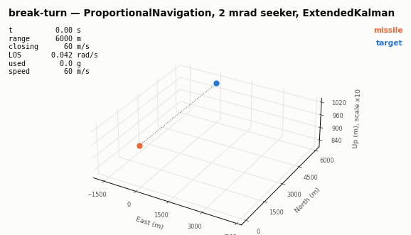
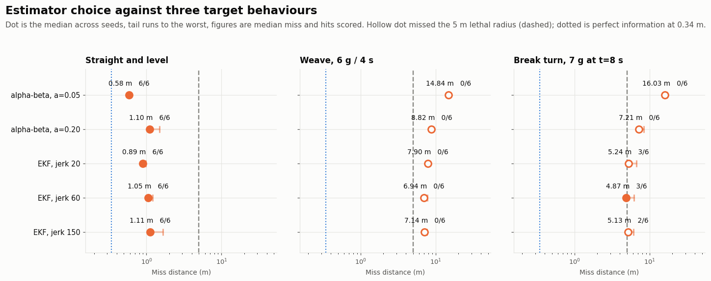
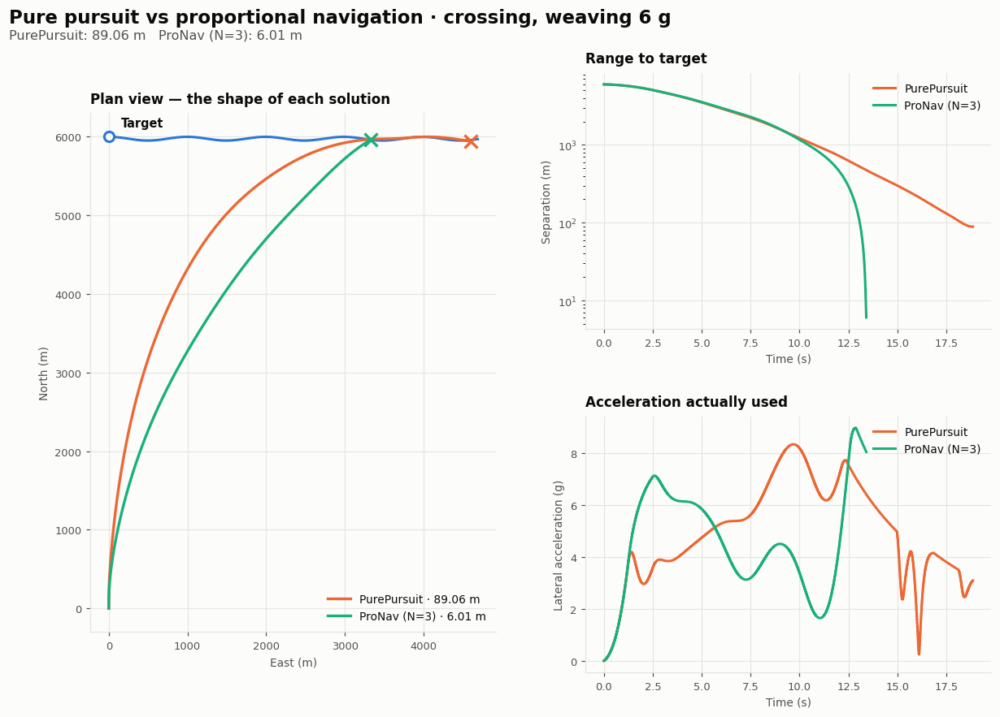
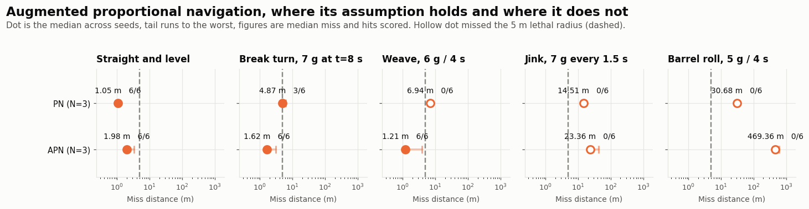
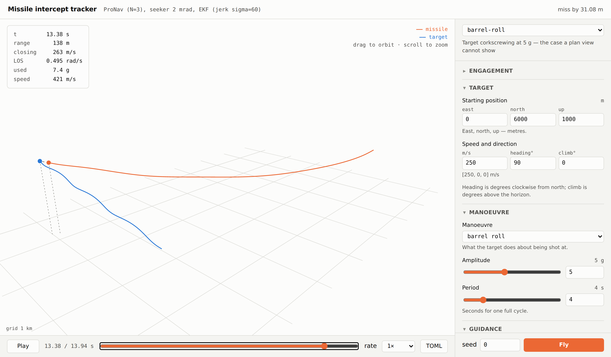

# Missile Intercept Tracker

[](https://github.com/AlexF0643/missile-intercept-tracker/actions/workflows/ci.yml)
[](https://www.python.org/downloads/)
[](LICENSE)

A 3-DOF missile intercept simulation in Python. A noisy radar seeker measures a
manoeuvring target a hundred times a second, a filter turns those measurements
into a track, and a proportional-navigation law turns that track into steering
commands — rendered live in 3D.

> **Status: Phase 7, parts one and three.** Engagements can be watched rather than only
> plotted; turning now costs energy, so the missile can no longer manoeuvre for
> free; and the guidance law can now use the target acceleration the filter
> estimates — which recovers the manoeuvring cases that cost broke. And it all
> now runs in a browser window where any parameter can be changed and re-flown,
> which is how the augmented law's failures turned out to have a different cause
> than the obvious one. Monte Carlo next.



A target flying straight, breaking hard at 7 g eight seconds in, and being
intercepted anyway — 3.7 m from a round guided by a 2 mrad seeker and an
extended Kalman filter. The endgame plays at quarter speed because at Mach 2 the
last hundred metres take under a tenth of a second.

That is one seed, and worth saying so: across six seeds this engagement is a hit
only three times, median miss 4.9 m against a 5 m lethal radius. It became a
coin toss when induced drag was added — see [below](#turning-is-not-free).

Watch the line-of-sight rate on the readout. Proportional navigation works by
holding it steady while the range falls, and it runs away at the very end
because `Omega = (r x v) / (r . r)` has the range squared underneath it — which
is why terminal guidance saturates however much airframe you give it.

```bash
interceptor record break-turn -o flight.gif   # the animation above
interceptor view break-turn                   # the same thing, live and orbitable
```

## The filter that makes it possible



Phase 4 ended in failure, deliberately left in place: proportional navigation
that intercepted within 34 cm on perfect information missed by **1644 m** once it
had to work from a 2 mrad seeker. Nothing was wrong with the guidance law. What
was wrong is that relative velocity was obtained by differencing two noisy
positions 10 ms apart, which multiplies the angle error by a hundred.

Phase 5 puts an estimator in that gap — the same seeker, the same guidance law,
something sensible in between. **1644 m becomes 1.05 m**, a factor of about
1500, and every estimator scores 6 hits from 6 against a target flying straight.

Against a target that manoeuvres, none of them do. That is new, and it is the
subject of the section after next.

The more interesting result is the one the three panels exist to show. Against a
straight target the heavily-smoothed alpha-beta filter is the *best* thing here
(0.58 m): averaging beats noise, and there is no signal being averaged away.
Against a 7 g break turn the same filter is the *worst* by a factor of three —
16.03 m — because the smoothing that rejected the noise also rejects the
manoeuvre. Its gains were fixed in advance, and it cannot revisit that decision
when the target does something new.

The EKF is never quite the best in any single panel and never bad in any of
them, because it recomputes how much to trust its own prediction on every frame
from its own covariance. That is the trade the phase is about: a fixed gain has
to be chosen for behaviour you do not get to know beforehand.

The filter also **coasts through a 0.5 s blackout** — it keeps predicting when
there is nothing to correct with, where the naive version threw the track away
and the missile flew blind.

### Is the filter honest about its own uncertainty?

Miss distance says whether the estimate was *accurate*. It says nothing about
whether the covariance the filter reports alongside it is *truthful*, and those
come apart in a way that matters. A filter that understates its uncertainty runs
too small a gain, so it discounts measurements that disagree with it — tracking
a quiet target immaculately and then arriving late on the manoeuvre that counts.

The standard check is NEES: measure the error in units of the filter's own
claimed uncertainty, and it should average to the number of states, here 6.
Across 24 independent seeds the EKF scores **6.16 against an expected 6.00**,
inside the 95% interval, and stays there against a 6 g weave its
constant-acceleration model does not describe and across a 600-fold range of
process-noise tuning.

It did not the first time it was asked. It scored **1804** — a three-sigma bias
hiding under a filter that was hitting the target anyway. The seeker models one
frame of processing latency and stamps each measurement with when it was
*taken*, but the track was correcting its current state with that stale
measurement and with the missile's *current* position. That folds one frame of
relative motion into every estimate as a standing offset: 6.5 m at 650 m/s of
closing, against a filter claiming about 2 m of uncertainty.

Fixing it barely moved the miss distance — a few centimetres — which is precisely
why it needed a consistency check to find. It would have quietly corrupted the
Phase 7 miss-distance distribution, where the covariance stops being diagnostic
and starts being the answer.

## Turning is not free

Every number above changed when the aerodynamics learned that lift costs drag.

A body at incidence makes its normal force perpendicular to its own axis rather
than to the flight path, so part of that force points backwards:
`Cd = Cd0 + k·Cn²`, with `k = 1/Cn_alpha`. The lift-curve slope is simply the
peak lift coefficient divided by the angle it needs, so the airframe already
declared everything required to work out what its own turns cost. At full lift
that is **roughly four times the zero-lift drag**. Before this, the missile
manoeuvred for nothing.

The correction overturned a headline result and replaced it with a better one.
Pure pursuit used to miss a straight crossing target by 40.8 m; it now hits by
1 cm. Not a rescue — slowed by its own turning it never overshoots, so it
settles into a stern chase and eventually runs a straight-flying target down.
Look at what that costs, and at what happens the moment the target does
anything at all:

```
crossing geometry            miss       at   closing   arrival
  straight, pursuit         0.01 m   18.78s     72       322 m/s
  straight, pronav          0.34 m   13.51s    284       449 m/s
  weaving 6 g, pursuit     89.06 m   18.86s     75       273 m/s
  weaving 6 g, pronav       6.01 m   13.41s    282       430 m/s
```

So the old claim was partly an artefact of a missile fast enough to overshoot.
The true one is stronger: pursuit succeeds only against a target that flies
perfectly straight and grants it nineteen seconds, and it arrives with a quarter
of the closing speed. A round with no closing speed left has no answer to a
target that changes its mind — which is exactly what the weave row shows.

It also moved the Phase 5 result. Against a manoeuvring target, proportional
navigation with a well-tuned EKF now **misses**: 6.94 m on the weave, 4.87 m on
the break turn, where the lethal radius is 5. The missile spends its energy
turning and arrives too slow to correct. That is not a regression in the code —
it is the model becoming honest, and it is the gap
[the next section](#a-law-that-knows-the-target-is-turning) closes, using the
target acceleration the EKF is already estimating and already
[verified honest](#is-the-filter-honest-about-its-own-uncertainty).

**The coefficient is an engineering estimate, not a citation.** The form is
standard and the magnitude is right, but a real design would take `Cn_alpha`
from a wind-tunnel database — Fleeman's *Tactical Missile Design*, or USAF
DATCOM. It is a placeholder with correct physics behind it, and it is labelled
as one in the source.



Same missile, same weaving target, same data — only the guidance law differs.
Pure pursuit steers at where the target *is*, swings wide into a tail chase and
misses by **89.1 m**. Proportional navigation steers to stop the *bearing*
drifting, flies inside that arc to a point ahead of the target, and misses by
**6.0 m** — while finishing five and a half seconds sooner and arriving with
four times the closing speed.

The mechanism is visible in the middle panel: PN's separation collapses, while
pursuit's decays slowly and is still decaying when the run ends. And on a
straight target PN does it using *less* acceleration, not more — it removes the
need for the turn rather than flying it faster.

## A law that knows the target is turning

Proportional navigation drives the line-of-sight rate to zero, which is exactly
right against a target flying straight and always one step behind a target that
is accelerating: it reacts to bearing drift the manoeuvre has *already* caused.
Augmented proportional navigation adds a term for the acceleration itself.

```
a = N·V_c·(Ω × r̂)  +  (N/2)·a_t⊥
```

`N/2` is not a tuning knob. It is the optimal-control solution for a target
holding **constant** acceleration, derived under the same criterion that gives
`N = 3` against one holding none — so the obvious question is what happens when
the target does not oblige. That turns out not to be the question that matters,
but the results are what led to the one that does:

```
crossing geometry, seeker + EKF, 6 seeds     PN (N=3)          APN (N=3)
  straight and level                     1.05 m   6/6      1.98 m   6/6
  break turn, 7 g at t=8 s               4.87 m   3/6      1.62 m   6/6
  weave, 6 g / 4 s                       6.94 m   0/6      1.21 m   6/6
  jink, 7 g every 1.5 s                 14.51 m   0/6     23.36 m   0/6
  barrel roll, 5 g / 4 s                30.68 m   0/6    469.36 m   0/6
```



The two rows induced drag broke come back, and they come back completely: the
break turn goes from a coin toss to six hits from six, and the weave from never
hitting to never missing. Both of those targets hold their acceleration long
enough for the assumption to be true, and where it is true the term is worth
three to six times in miss distance — and, more to the point, the difference
between a round that arrives inside its lethal radius and one that does not.

The bottom two rows are the more useful half. **A barrel roll makes APN twelve
times worse than the law it augments**, and it does so on a *perfect* track,
which at least rules the filter out: this is not a bad acceleration estimate.

The obvious reading is that APN's assumption has broken — a barrel roll holds
acceleration *magnitude* constant while rotating its *direction*, so the lead
never decays. That reading is wrong, and finding out how wrong is the most
useful thing in this section. Vary one number, the missile's maximum lift
coefficient, and hold everything else fixed:

```
Cl_max              PN                              APN
 2.5     24.44 m,  18% saturated      310.98 m,  40% saturated, arrives 265 m/s
 3.0     13.90 m,  14%                 88.17 m,  32%
 3.5      8.61 m,  12%                  7.53 m,  20%
 4.0      5.84 m,  10%                  0.51 m,  10%
 5.0      3.31 m,   7%                  0.02 m,   9%, arrives 420 m/s
```

Give the airframe twice the lift and APN goes from twelve times worse than PN to
a hundred and fifty times better — against the very manoeuvre that was supposed
to defeat it. **The lead term is not defeated by the barrel roll. It is defeated
by an airframe that cannot deliver what it asks for.** APN commands roughly half
as much again as PN, and where that request can be met it is worth a large
factor; where it saturates, the surplus is never produced, but the lift that
*is* produced still costs induced drag, so the missile pays for the whole
command and receives part of it. It arrives at 265 m/s instead of 420 with
nothing left to correct with.

That single mechanism covers the rest. A weave banked 60° out of the horizontal
misses by 306 m with APN and 21 m with PN — the acceleration reverses just as it
does in the flat weave APN wins, but the missile is already spending lift on
staying up, so the same extra demand saturates. Raise the lift coefficient and
that case collapses to 0.41 m too. The jink is the one place where the filter
really is the problem: on a perfect track APN handles it well (1.52 m against
11.11 m) and only loses through the seeker, because the EKF's acceleration error
over the last two seconds runs at a median 12.0 g against a target pulling 7.0,
and APN multiplies that by `N/2` on its way into the command — about 18 g of
noise. On the weave the same filter is wrong by 1.8 g and the same term is worth
a factor of six.

So: **augmentation is a request for lift, and it is only free when there is lift
to spare.** Which makes it uncomfortable that the number deciding all of this,
`max_lift_coefficient = 2.5`, is one of the constants this project
[cannot cite](#modelling-assumptions). An uncited value is currently the
difference between a law that is excellent and one that is catastrophic, which
is a better argument for sourcing the constants than any amount of tidiness.

This is left as it is and asserted in the tests rather than tuned away. A law
whose benefit depends on a margin the airframe may or may not have is a more
useful thing to understand than one silently switched for whichever currently
wins.

```bash
interceptor run augmented                 # the break turn, with APN
python examples/augmented_pronav.py       # the figure above (~6 min)
```

## One window, every parameter

```bash
interceptor serve      # opens a browser; Ctrl-C to stop
```



The engagement on the left, the whole scenario on the right. Change the target's
speed and heading, give it a barrel roll, switch the guidance law, turn the
seeker off, drag the sliders — and fly it again without touching a file. The
transport under the view scrubs through the flight; the readout is the same six
numbers the 3D viewer shows, and the line-of-sight rate is the one to watch as
the range collapses.

Three things about how it is built, because each was a decision rather than a
default:

- **It is the standard library.** `http.server`, no framework; a canvas and a
  hand-rolled perspective projection, no three.js and no CDN. The app works with
  no network at all, and the package still installs with nothing but numpy.
- **The browser never decides what a valid scenario is.** The form builds TOML —
  the same text `interceptor show --raw` prints, visible and editable in the
  TOML pane — and posts it to the same reader a file goes through. Every bound,
  every default and every *did you mean `glint_sigma`?* is the one the command
  line already uses, so the two cannot drift apart.
- **The form is generated from a table**, not written out by hand, and two tests
  hold that table to the validator: every combination of manoeuvre, law and
  estimator must resolve, and every default must equal what *leaving the key
  out* would mean. The second caught two controls that quietly disagreed with
  the file semantics.

It earned its keep immediately: changing one parameter and watching the result
is how the APN diagnosis above turned out to be wrong.

## Run one without writing any Python

Engagements are TOML files. The package ships several and the command-line tool
flies them:

```bash
interceptor list                              # what ships with the package
interceptor show crossing                     # describe one without flying it
interceptor run crossing --seed 3             # fly it
interceptor sweep crossing --seeds 20         # fly it 20 times, report the spread
interceptor run crossing --figure out.png     # five-panel diagnostic
interceptor record crossing -o flight.gif     # 3D animation
interceptor view crossing                     # live, orbitable 3D window
interceptor serve                             # all of it, in one browser window
```

The viewer comes in two halves for a reason. `record` writes a file with
matplotlib and needs only the `viz` extra, so it works on a build server and its
output can be checked by a test. `view` opens a real WebGL scene through VPython
(`pip install -e ".[live]"`) that you can orbit with a mouse while the
engagement plays. Both drive the same scene model, so they cannot disagree about
where anything is.

To make your own, copy one and edit it. `reference` is the annotated one —
every setting there is, with its default and a note on what it does:

```bash
interceptor show reference --raw > my-scenario.toml
interceptor run my-scenario.toml
```

You can also drive it from Python rather than the shell:

```python
from interceptor.config import load_bundled
from interceptor.sim.engagement import run

spec = load_bundled("crossing")  # or config.load("my-scenario.toml")
world, detector = spec.build(seed=0)
result = run(world, duration=spec.scenario.duration, dt=1e-3, stop=detector)

print(f"{detector.result.miss_distance:.2f} m, hit={detector.result.hit}")
```

Every physical quantity is in there — launch geometry, motor, airframe limits,
the full seeker error budget, the guidance law, the estimator and its tuning:

```toml
[target]
position = [0.0, 6000.0, 1000.0]
velocity = [250.0, 0.0, 0.0]

[target.manoeuvre]
kind = "break_turn"      # straight | weave | break_turn | barrel_roll | jink
amplitude_g = 7.0
start_time = 8.0

[guidance]
law = "apn"              # pronav | apn | pursuit | none
navigation_constant = 3.0

[seeker]
angle_sigma = 0.002      # radians; the dominant error
glint_sigma = 1.5        # metres, so its angular effect grows as range falls

[estimator]
kind = "ekf"             # none | alpha_beta | ekf
jerk_sigma = 60.0
```

A key the schema does not recognise is an error, not a shrug:

```
$ interceptor run my-scenario.toml
error: seeker.glint: unknown key — did you mean 'glint_sigma'?
```

Which matters more than it looks. A config format that silently ignores
`anglesigma = 0.002` costs somebody an afternoon wondering why the noise
setting does nothing.

## Diagnostic figures

```bash
python examples/estimator_comparison.py   # miss distance by estimator (~7 min)
python examples/augmented_pronav.py       # PN against APN, five behaviours (~6 min)
python examples/seeker_sweep.py           # miss distance against seeker noise
python examples/compare_laws.py           # pursuit vs PN, all three geometries
python examples/pursuit.py                # one law, five diagnostic panels
python examples/ballistic.py              # unguided flight, vacuum vs drag
```

```
crossing geometry, realistic seeker, 6 seeds       median miss    hits
  no estimator (Phase 4)                              1644.4 m    0/6
  alpha-beta, a=0.05, straight target                    0.58 m   6/6
  alpha-beta, a=0.05, 7 g break turn                    16.03 m   0/6
  EKF, jerk 60, straight target                          1.05 m   6/6
  EKF, jerk 60, 7 g break turn                           4.87 m   3/6
  EKF, jerk 60, 7 g break turn, APN                      1.62 m   6/6
  perfect information (Phase 3 baseline)                 0.34 m   6/6
```

```
crossing, weaving 6 g
  law                 miss (m)      at   closing   peak demand   peak used    arrival
  PurePursuit           89.059  18.86s      75          49.1 g       8.3 g      273 m/s
  ProNav (N=3)           6.011  13.41s     282        1415.6 g       9.0 g      430 m/s
```

## Why this exists

The interesting behaviour in an engagement simulation lives at the boundaries
between three layers, not inside any one of them:

- **World** — truth. Where everything actually is, integrated at a fixed step.
- **Seeker** — the missile's only, deliberately lossy, window onto that truth:
  noisy, delayed, limited in field of view and prone to dropping out.
- **Guidance** — estimates what it can from that window, and commands a lateral
  acceleration the airframe may or may not be able to deliver.

A guidance law that intercepts perfectly on truth data starts missing when fed a
2 mrad angle error; a filter buys the performance back; the filter then lags on a
hard-manoeuvring target and needs a target-acceleration term. That progression is
the project.

Each layer talks to the next through one small type. The guidance law is handed
a `Track` and nothing else, so the same proportional navigation runs unchanged on
truth, on raw seeker measurements, and behind a filter — which makes "try this
law on perfect information" a one-line move for diagnosing anything downstream of
it.

## Roadmap

| Phase | Scope | Exit criterion | Status |
| :---- | :---- | :------------- | :----- |
| 0 | Scaffolding, lint, types, CI | Green CI on an empty project | ✅ |
| 1 | World, RK4 integrator, ballistics | Drag-free launch matches the analytic parabola to 1e-6 over 10 s | ✅ 3.4e-10 m |
| 2 | Pure pursuit on truth data | First intercept against a non-manoeuvring target | ✅ 3.2 m head-on |
| 3 | Proportional navigation on truth data | ≥10× lower miss distance than pursuit on a crossing target | ✅ 15× on a weaving one |
| 4 | Seeker: frames, gimbal gating, noise, dropouts | Monotonic noise-vs-miss-distance sweep | ✅ 0.33 m → 1644 m |
| 5 | Estimation: alpha-beta, then EKF | Inside the 5 m lethal radius on a realistic seeker; survives a 0.5 s dropout | ✅ 1644 m → 1.05 m |
| 6 | Real-time 3D viewer | A recording good enough to head this README | ✅ above |
| 7a | Augmented PN | Recover the manoeuvring cases induced drag broke | ✅ 0/6 → 6/6 on the weave |
| 7c | Browser app | Change any parameter and re-fly without leaving the window | ✅ `interceptor serve` |
| 7b | Monte Carlo | Miss distribution over 1000 runs | ⬜ |

Two criteria were rewritten rather than quietly restated, and both are worth the
paragraph.

**Phase 5** originally asked for *"within 2× of the perfect-information
baseline"* — 0.06 m. Unachievable, and for a physical reason rather than an
implementation one. Perfect information has no glint; a real seeker sees a
target as a scattering body roughly 1.5 m across, and which part of it dominates
the return wanders from pulse to pulse. As range falls that metre-scale wander
subtends a *growing* angle, so the last second of flight is the noisiest. No
filter can average away an error that peaks exactly when there is no time left
to average. Sub-metre is the floor the physics allows, so the criterion became
the one that decides an engagement: does the round arrive inside its lethal
radius.

**Phase 3** originally compared miss distances against a straight crossing
target. Induced drag ended pure pursuit's overshoot, so it now converges on a
straight target and the comparison stopped separating the two laws — not because
pursuit improved, but because the test had been measuring an artefact. It is now
flown against a weaving target, where the order of magnitude returns and then
some. A criterion that survives a physics correction unchanged was probably
measuring the wrong thing.

## Install

```bash
git clone https://github.com/AlexF0643/missile-intercept-tracker.git
cd missile-intercept-tracker
python -m venv .venv && source .venv/bin/activate   # Windows: .venv\Scripts\activate
pip install -e ".[dev]"
pre-commit install
```

## Develop

```bash
pip install -e ".[dev,viz]"   # viz adds matplotlib for the diagnostic figures
pytest                        # full suite
pytest -m "not gui"           # what CI runs
ruff check . && ruff format .
mypy
```

## Modelling assumptions

Stated up front, because the boundary of a model is part of the model:

- 3 degrees of freedom — point mass, no attitude state. The seeker boresight is
  taken as the velocity vector, i.e. zero angle of attack.
- Flat, non-rotating earth. No Coriolis, no earth curvature.
- Exponential atmosphere, `rho = 1.225 * exp(-h / 8500)`.
- Point-mass aerodynamics: a constant zero-lift drag coefficient plus an induced
  term `k·Cn²`, no Mach dependence and no wind-tunnel database. The missile
  spends only half a second of a twelve-second flight in the transonic band, so
  a Mach-indexed table would change little; induced drag, which was missing
  until recently, changed a great deal.
- The seeker is modelled at the measurement level — true geometry corrupted by
  noise, latency and dropouts — not at the level of transmitted waveforms.

## References

- Zarchan, P. *Tactical and Strategic Missile Guidance*, AIAA.
- Siouris, G. M. *Missile Guidance and Control Systems*, Springer.

## License

MIT — see [LICENSE](LICENSE).
